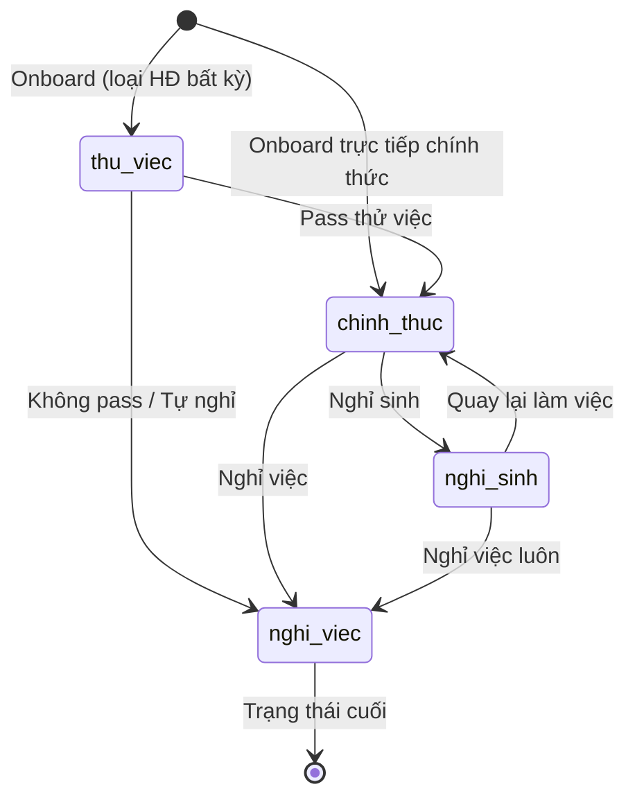
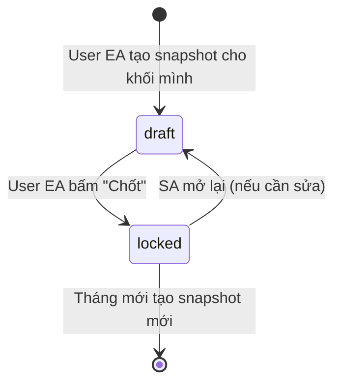

# 🔄 STATE MACHINES — Bảng chuyển trạng thái

---

## 1. Employee State (Trạng thái nhân sự) {#employee_state}

### 1.1. Danh sách trạng thái

| Trạng thái | Enum Value | Mô tả |
|------------|-----------|-------|
| **Thử việc** | `thu_viec` | NS mới, đang trong thời gian thử việc |
| **Chính thức** | `chinh_thuc` | NS chính thức, đang làm việc |
| **Nghỉ sinh** | `nghi_sinh` | NS đang nghỉ sinh |
| **Nghỉ việc** | `nghi_viec` | NS đã nghỉ việc (trạng thái cuối) |

### 1.2. State Diagram



### 1.3. Bảng chuyển trạng thái

| Từ | Sang | Điều kiện | Ai thực hiện | Khi nào | Ghi chú |
|----|------|-----------|-------------|---------|---------|
| `[NEW]` | `thu_viec` | NS mới có thời gian thử việc | User EA | Ngày onboard | Default |
| `[NEW]` | `chinh_thuc` | NS ký HĐ chính thức (không thử việc) | User EA | Ngày onboard | Tuyển thẳng |
| `thu_viec` | `chinh_thuc` | Đã pass thử việc | User EA | Ngày 30 hàng tháng | |
| `thu_viec` | `nghi_viec` | Không pass / tự nghỉ | User EA | Ngày 30 hàng tháng | |
| `chinh_thuc` | `nghi_sinh` | Thông tin từ bảng công | User EA | Ngày 30 hàng tháng | Nhập ngày nghỉ sinh |
| `chinh_thuc` | `nghi_viec` | NS nghỉ việc | User EA | Ngày 30 hàng tháng | Nhập ngày nghỉ việc |
| `nghi_sinh` | `chinh_thuc` | NS quay lại làm việc | User EA | Khi có thông tin | |
| `nghi_sinh` | `nghi_viec` | NS nghỉ việc luôn | User EA | Khi có thông tin | |

### 1.4. Business Rules

- **BR-STATE-001**: IF `trang_thai` = `nghi_viec` THEN block thay đổi (trừ SA)
- **BR-STATE-002**: IF `trang_thai` = `nghi_viec` THEN NS vẫn xuất hiện khi tìm kiếm (có filter)
- **BR-STATE-003**: IF NS cũ tái tuyển THEN tạo bản ghi MỚI, mã NS MỚI
- **BR-STATE-004**: IF `trang_thai` = `thu_viec` AND `loai_hop_dong` = `ctv` THEN vẫn hợp lệ
- **BR-STATE-005**: Chuyển trạng thái PHẢI ghi [Change History](./SCHEMA.md#change_history) + [Audit Log](./SCHEMA.md#audit_log)

---

## 2. State Phòng Chờ {#state_phong_cho}

> `state_phong_cho` là **boolean flag** trên bản ghi employee, KHÔNG phải trạng thái nhân sự.

| `state_phong_cho` | Ý nghĩa | Ảnh hưởng |
|-------------------|---------|-----------|
| `true` | Đang trong phòng chờ | Nhân sự mới (New Hire chưa duyệt) có ngày bắt đầu trước hoặc bằng ngày kết thúc kỳ lương, hoặc nhân sự cũ vướng ngày hiệu lực trong kỳ lương sẽ chặn chốt snapshot. Nhân sự cũ không vướng ngày hiệu lực vẫn được tính vào snapshot bằng dữ liệu live. |
| `false` | Đã submit, hoàn tất | NS hiển thị bình thường trong UI thông tin nhân sự |

### Case phòng chờ: NS mới (Case Setup)

```
User EA nhập NS mới → state_phong_cho = true → lưu vào table employees
→ NS hiển thị trong UI phòng chờ
→ User EA xử lý → lưu → state_phong_cho = false
→ NS xuất hiện trong UI thông tin nhân sự
```

> **Lưu ý**: Cập nhật thông tin nhân sự có upload giấy tờ (Điều chỉnh lương, Bổ nhiệm, Nghỉ sinh, Đánh giá) BẮT BUỘC qua phòng chờ (`state_phong_cho` = `true`). Các nâng cấp thông tin cá nhân thông thường lưu trực tiếp.

### Business Rules

- **BR-PC-001**: IF tạo bản ghi mới THEN `state_phong_cho` = `true` (mặc định)
- **BR-PC-002**: IF `state_phong_cho` = `true` AND là nhân sự mới chưa duyệt (có `tuyen_moi` document và `temp_uuid IS NOT NULL`) THEN NS không xuất hiện trong snapshot. Đối với nhân sự cũ ở phòng chờ không vướng ngày hiệu lực, họ vẫn được copy vào snapshot bằng dữ liệu live.
- **BR-PC-003**: User EA có quyền "Submit" (state_phong_cho: true → false)
- **BR-PC-004**: Mọi thay đổi có giấy tờ/chuyển trạng thái/chuyển khối cho nhân sự TỒN TẠI đều phải lưu vào trường `pending_changes` (JSONB) và đặt `state_phong_cho` = `true` để chờ duyệt, TRÁNH ghi đè cột live lúc chưa duyệt.
- **BR-PC-005**: (Submit Semantics) Khi User EA duyệt phòng chờ (Submit: `state_phong_cho`: `true` → `false`):
  1. Payload trong `pending_changes` sẽ được apply/ghi đè lên các cột live tương ứng của `employees` và `salaries`.
  2. Trường `pending_changes` sẽ bị reset về `{}` (JSON rỗng).
  3. Cập nhật `trang_thai` nếu payload có chuyển trạng thái. **Lưu ý**: Nếu chuyển từ `nghi_sinh` sang `chinh_thuc` (Đi làm lại), hệ thống sẽ SET NULL `ngay_nghi_sinh`.
  4. Hệ thống sinh Audit Log và Change History cho các trường vừa được apply. Điển hình như `ngay_di_lam_lai` chỉ được truyền qua payload để ghi Log chứ không tồn tại vật lý.
  5. Nếu `khong_co_nnt` được check = `true`, bản ghi sẽ được lưu cờ `khong_co_nnt: true` ở database để bỏ qua các bước validate gán NNT. Khớp với luồng nghiệp vụ bypass chờ nghiệm thu.

---

## 3. Snapshot State (Trạng thái bản chốt — PER KHỐI) {#snapshot_state}

### 3.1. Danh sách trạng thái

| Trạng thái | Enum Value | Mô tả |
|------------|-----------|-------|
| **Nháp** | `draft` | Đang chuẩn bị, chưa chốt chính thức |
| **Đã chốt** | `locked` | Đã chốt, data cố định |

### 3.2. State Diagram



### 3.3. Bảng chuyển trạng thái

| Từ | Sang | Ai | Ghi chú |
|----|------|----|---------|
| `[NEW]` | `draft` | EA (khối mình) | Tạo snapshot cho khối. Copy data NS |
| `draft` | `locked` | EA (khối mình) | Set `locked_at` = now(). Ghi audit log |
| `locked` | `draft` | SA only | Clear `locked_at` = NULL. Giữ data cũ. Ghi audit log + lý do |
| `draft` (rechốt) | `locked` | EA (khối mình) | Backend App Backup data cũ → GCS → DB xóa cũ & copy mới → Lock |

### 3.4. Business Rules

- **BR-SNAP-001**: Mỗi khối mỗi tháng chỉ có **1 snapshot** (UNIQUE: month + khoi)
- **BR-SNAP-002**: IF `locked` THEN không sửa (trừ SA mở lại)
- **BR-SNAP-003**: SA mở lại → PHẢI ghi lý do
- **BR-SNAP-004**: Snapshot chứa nhân sự có `state_phong_cho` = `false` hoặc nhân sự cũ có `state_phong_cho` = `true` nhưng không vướng ngày hiệu lực trong kỳ lương thuộc khối đó.
- **BR-SNAP-004.1**: ⛔ BLOCK TẠO SNAPSHOT: Nếu có nhân sự mới chưa duyệt vướng ngày bắt đầu <= ngày kết thúc kỳ lương, hoặc nhân sự cũ trong phòng chờ có thay đổi vướng ngày hiệu lực trong kỳ lương, thao tác Lock/Create Snapshot bị chặn.
- **BR-SNAP-005**: Deadline chốt: cuối tháng
- **BR-SNAP-006**: NS `nghi_viec` chỉ nằm trong snapshot nếu `ngay_nghi_viec` thuộc tháng snapshot
- **BR-SNAP-007**: Lock/Unlock PHẢI validate `snapshot_status` hiện tại. Return `STATE_ERROR` nếu transition không hợp lệ
- **BR-SNAP-008**: Rechốt (draft có data cũ) → Backend App export data cũ qua Google Cloud Storage (miễn phí) → DB xóa → re-copy → lock

---

*File này định nghĩa tất cả state machines. Mọi module PHẢI tuân theo.*
*Cập nhật: 2026-04-05 — v2.6.0*
