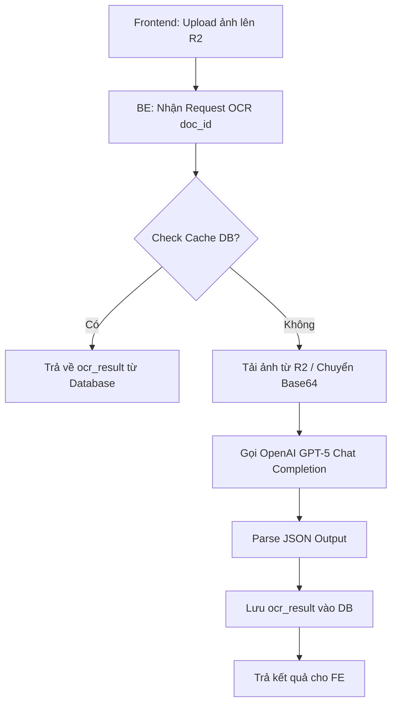

# Feature Plan: Phase 2 — NS-001 Employee CRUD

> **Trạng thái**: ✅ ĐÃ DUYỆT
> **Review gate**: ✅ ĐỒNG Ý — User xác nhận 2026-03-31. Cho phép triển khai toàn bộ Phase A–E.
> **Feature slug**: phase-2-ns-001-employee-crud
> **Tạo bởi**: feature-plan
> **Ngày tạo**: 2026-03-26
> **Cập nhật cuối**: 2026-03-31 (Sửa Phase E theo KTS: đúng schema gốc, create-only, có bind temp_uuid)

---

## 1. Bối cảnh và mục tiêu

- **Bối cảnh:** Phase 0 (Infra) và Phase 1 (Auth & Permission Engine) đã hoàn thành. Hạ tầng monorepo, CI/CD, DB schema v2.5.0, RLS, auth middleware, permission middleware + Redis cache, guards, rate limit đều đã sẵn sàng. Hiện tại các route `/employees` trên FE chỉ là placeholder.
- **Vấn đề cần giải quyết:** Chưa có CRUD nhân sự thực tế — user EA/SA không thể thêm/sửa/xem nhân sự, phòng chờ chưa hoạt động, không có search/filter/pagination.
- **Mục tiêu:** Xây dựng hoàn chỉnh module NS-001 (Employee CRUD) bao gồm API endpoints + FE pages, cho phép EA/SA thêm/sửa/submit nhân sự, phòng chờ hoạt động, search/filter/sort/pagination, và export Excel.
- **Kết quả mong đợi:** Luồng thêm NS mới → phòng chờ → submit → hiển thị trong danh sách hoạt động end-to-end. Change history được ghi tự động.

## 2. Phạm vi

### In scope
- **BE — API routes**: CRUD employees (GET list + pagination/sort/filter, GET detail, POST create, PUT update, PUT submit phòng chờ, PUT đưa lại phòng chờ, PUT state transition, DELETE soft — SA only)
- **BE — Service layer**: Employee service xử lý business logic (state transitions với state machine validation, validation, change history, audit log)
- **BE — Change History**: Auto ghi `change_history` khi sửa employee fields, submit/pending, và state transitions + ghi `audit_log`
- **BE — Reviewer-as-EA authorization**: Route-level query `employee_reviewers` để check quyền per-employee (xem thiết kế chi tiết mục 7a). Một Reviewer được nâng cấp lên level `EA` cho nhân sự được gán; quyền này **cộng dồn (additive)** với quyền trên khối hiện có của họ (BR-PERM-004).
- **BE — State Transition API**: Route riêng `PUT /api/employees/:id/state` với state machine validation theo STATE_MACHINES.md. Generic update KHÔNG được phép sửa `trang_thai` và `state_phong_cho`
- **BE — Export audit**: Ghi audit_log action `export` inline khi `GET /api/employees` detect `limit=all`. Wire `exportRateLimiter` riêng (5 req/min/user — theo master plan). KHÔNG tạo endpoint export riêng.
- **BE — Email duplicate check**: Route `GET /api/employees/check-email?email=xxx` trả về `{ exists, matches[] }` cho FE hiển thị warning. KHÔNG reject khi tạo mới (cho phép email trùng — BR tái tuyển).
- **BE — Upload giấy tờ NS (Create-only)** *(Bổ sung 2026-03-31)*: API upload ảnh giấy tờ dùng BE Hono (S3 SDK) cấp Cloudflare R2 Signed URL. API check authz chặn EA sai khối bằng trường `khoi` nộp lên. Cung cấp flow bind `temp_uuid` → `employee_id` thông qua payload POST. Mọi thao tác tài liệu bị khoá cứng (403) đối với user cấp `VI/VA` (Ngoại trừ trường hợp họ là Reviewer của chính NS đó thì được cấp quyền `EA` theo quy tắc Conflict Resolution).
- **BE — AI OCR auto-fill** *(Bổ sung 2026-03-31)*: Từ ảnh upload → gọi AI OCR service detect nội dung (họ tên, ngày sinh, SĐT, CCCD...) → trả về JSON fields gợi ý để FE tự điền vào form. EA kiểm tra/chỉnh sửa trước khi lưu.
- **FE — Danh sách NS**: Ant Design Table (server-side pagination, search ho_va_ten/email, filter theo khối/trang_thai/phòng chờ, sort)
- **FE — Form thêm/sửa NS**: Ant Design Form + Zod validation (25 trường), phân biệt mode create vs edit. Email blur → warning nếu trùng (không block).
- **FE — Upload giấy tờ component (Chỉ hiển thị mode Create)** *(Bổ sung 2026-03-31)*: Trong form tạo NS MỚI — upload ảnh giấy tờ (Ant Upload), preview, xóa file. Dùng `temp_uuid` linking. Nút "AI OCR Đọc" → tự điền form fields. Chặn không cho dùng ở mode edit để tôn trọng luồng `pending_changes` đối với NS đã có trên hệ thống.
- **FE — Phòng chờ**: Trang riêng hoặc tab filter `state_phong_cho = true`, nút Submit
- **FE — Chi tiết NS**: Trang view chi tiết 1 nhân sự + state transition UI
- **FE — Export Excel**: Xuất danh sách NS ra file xlsx (chỉ employee info, watermark gồm `exported_by`, `exported_at`, `khoi`)
- **Permission enforcement**: EA/SA create/edit, VI/VA read-only. Phân biệt rõ: `VA` (View All) được xem lương; `VI` (View Info) bị chặn lương (phải dùng view `employee_info_only`). SA/EA có quyền soft delete.
- **Change History Masking**: `VI` được xem history nhưng hệ thống PHẢI ẩn các bản ghi thay đổi trường lương và lý do thay đổi (BR-PERM-005).
- **Reviewer as EA**: Route-level query per-employee (KHÔNG dùng boolean `is_reviewer` từ PermissionMatrix)

### Out of scope
- NS-002 (Salary CRUD) — Phase 3
- NS-003 (Snapshot) — Phase 5
- NS-004 Admin UI (Quản lý quyền, gán reviewer) — Phase 4
- `zodToAntRules()` utility hoàn chỉnh (deferred từ Phase 0, sẽ tạo cơ bản đủ dùng)
- **Hard delete NS** — defer sang Phase 4/6. Phase 2 chỉ soft delete (chuyển `nghi_viec`)
- Import data từ Sheets (Phase 4)
- Mở rộng `PermissionMatrix` cache reviewer_employee_ids (nếu performance cần ở tương lai, tách feature riêng)

## 3. Đối chiếu Knowledge Base

- **Quyết định kế thừa:**
  - Hybrid Security: API middleware check quyền + RLS `USING(false)`. Mọi query qua `service_role` key.
  - Single Source of Truth: Zod schema là gốc cho cả FE + BE validation.
  - Envelope API: Response dạng `{ data: T, meta: {...} }`, FE apiClient unwrap tự động.
  - Permission Cache: Redis key `v4:perm:{email}`, TTL 2h, active invalidation.
  - Salary Isolation: Route VI bắt buộc dùng view `employee_info_only`.
- **"Cấm kỵ" cần tránh:**
  - KHÔNG dùng `supabase.from()` ở FE để query data.
  - KHÔNG dùng Tailwind CSS.
  - KHÔNG skip permission check kể cả Redis down.
  - KHÔNG log secrets.
  - `ma_nhan_su` là IMMUTABLE — không được phép sửa sau khi tạo.
- **Ràng buộc kiến trúc liên quan:**
  - BE dùng Hono router + auth + permission middleware pipeline.
  - FE dùng TanStack Query cho server state, Zustand cho auth/UI state.
  - API pagination format: `?page=1&limit=50&sort=-created_at&khoi=...`
  - Error codes theo chuẩn đã chốt (UNAUTHORIZED, PERMISSION_DENIED, VALIDATION_ERROR, NOT_FOUND, CONFLICT, STATE_ERROR, INTERNAL_ERROR).
  - Employee email cho phép trùng (tái tuyển) — UI cảnh báo, không reject.

## 4. Giả định và câu hỏi mở

### Giả định
- **G1:** `zodToAntRules()` sẽ được implement dạng util helper cơ bản (map Zod schema → Ant Form rules) — đủ dùng cho 25 trường, không cần generic hoàn chỉnh.
- **G2:** Phòng chờ là trang riêng `/pending-room` theo plan routes ban đầu.
- **G3:** Search tìm theo `ho_va_ten` (ILIKE, index GIN đã có) + `email` (B-tree index đã có). Dùng query parameter `q` gửi về BE.
- **G4:** `can_edit` flag sẽ được tính server-side. Với user thông thường (EA/SA) → tính theo khối. Với reviewer → batch query `employee_reviewers WHERE reviewer_email = ? AND employee_id IN (...)` để tránh N+1.
- **G5:** Delete NS (SA only) chỉ soft delete (chuyển `nghi_viec`) ở Phase 2. Hard delete defer sang Phase 4/6.
- **G6:** Change History ghi tự động ở BE service layer bằng cách diff old vs new row. ÁP DỤNG cho cả update, submit, pending, state transition — theo BR-001-006 và BR-STATE-005.
- **G7:** Export Excel chỉ export employee info fields (không salary). Watermark gồm 3 trường: `exported_by` (email), `exported_at` (timestamp), `khoi`.
- **G8 (FR-04 clarification):** Workflow create yêu cầu `ma_nhan_su` + `email` + `ho_va_ten` + các NOT NULL fields ngay từ lúc tạo. TUY NHIÊN, đối với nhân sự mới có thể chưa cấp ngay mã/email thực, hệ thống cho phép bỏ trống `ma_nhan_su` và `email` khi gửi (Zod FE optional, BE tự sinh `TMP...`/`@vcc.tmp` để cho phép lưu nháp và pass constraint DB). Khi phòng chờ Submit chính thức thì phải điền field thật.
- **G9 (FR-01 strategy):** Reviewer-as-EA dùng **route-level query** (strategy B) thay vì mở rộng PermissionMatrix cache. Lý do: (1) Luôn chính xác, không phụ thuộc cache invalidation phức tạp. (2) Write operations ít frequent (không phải hot path). (3) Thêm 1 query `employee_reviewers` per write request — chấp nhận được.

### Câu hỏi mở
- [Non-blocking] `nguoi_bi_thay_the` (cột W) — logic cụ thể chưa rõ từ NS-001 Open Questions. Tạm implement dạng text input tự do.
- [Non-blocking] NS nghỉ sinh quay lại → clear `ngay_nghi_sinh` hay giữ? Tạm giữ nguyên giá trị.

## 5. Acceptance Criteria

- [ ] **AC-1**: API `GET /api/employees?khoi=X&page=1&limit=50` trả đúng danh sách phân trang, filter theo khối user có quyền. `khoi` optional — nếu không truyền, BE trả NS từ tất cả khối user có quyền. VI dùng view `employee_info_only`.
- [ ] **AC-2**: API `GET /api/employees/:id` trả chi tiết 1 NS (với `can_edit` flag). VI không thấy salary-related data.
- [ ] **AC-3**: API `POST /api/employees` tạo NS mới → `state_phong_cho = true`. `trang_thai` cho phép `thu_viec` (default) hoặc `dang_lam`. Cho phép bỏ trống `ma_nhan_su` và `email` khi gửi (BE tự sinh `TMP...`). **Chỉ EA/SA**.
- [ ] **AC-4**: API `PUT /api/employees/:id` cập nhật NS info fields → ghi Change History + Audit Log. `trang_thai` và `state_phong_cho` **KHÔNG** đi qua route này. Block sửa nếu `trang_thai = nghi_viec` (trừ SA). Chỉ EA/SA/Reviewer (per-employee).
- [ ] **AC-5**: API `PUT /api/employees/:id/submit` — Submit phòng chờ (`state_phong_cho: true → false`). Validate required fields. Ghi Change History + Audit Log. Chỉ EA/SA/Reviewer (per-employee).
- [ ] **AC-6**: API `PUT /api/employees/:id/pending` — Đưa lại phòng chờ (`state_phong_cho: false → true`). Ghi Change History + Audit Log. Chỉ EA/SA/Reviewer (per-employee).
- [ ] **AC-7**: API `DELETE /api/employees/:id` — **SA only** (reviewer KHÔNG được delete). Soft delete (chuyển `nghi_viec`). Ghi **Change History + Audit Log**.
- [ ] **AC-8**: API `PUT /api/employees/:id/state` — Chuyển trạng thái NS. Body: `{ new_state, ngay_nghi_sinh?, ngay_nghi_viec?, reason? }`. Validate theo bảng chuyển trạng thái STATE_MACHINES.md (VD: `thu_viec → dang_lam` OK, `nghi_viec → thu_viec` → 400 STATE_ERROR). `reason` optional, ghi vào change_history. Ghi Change History + Audit Log. Chỉ EA/SA/Reviewer (per-employee).
- [ ] **AC-9**: FE trang Danh sách NS — Ant Table + server-side pagination, search, phân khối/trạng thái. Đã chốt: **Danh sách chính luôn ẩn NS trong Phòng chờ**, để phòng chờ là một thế giới lưu trữ hoàn toàn riêng biệt không dính tới danh sách chính.
- [ ] **AC-10**: FE trang Phòng chờ — hiển thị NS có `state_phong_cho = true`, nút Submit.
- [ ] **AC-11**: FE form thêm/sửa NS — Ant Form + Zod validation, 23/25 trường. **Giới hạn scope Phase 2**: Các trường thuộc nghiệp vụ lương (vd: `ngay_dieu_chinh_luong`, `tam_ung_hang_thang`) sẽ được hiển thị View-only (Detail) và bị chặn sửa trong Form (Create/Update). Quyền sửa các trường này sẽ được triển khai trong Phase 3 cho EA/SA theo đúng PERMISSION_MATRIX §2c.
- [ ] **AC-12**: FE trang chi tiết NS — hiển thị full thông tin + state transition UI.
- [ ] **AC-13**: FE export Excel danh sách NS — watermark gồm `exported_by` (email), `exported_at` (timestamp), `khoi`. BE ghi audit_log action `export` inline trên `GET /api/employees?limit=all`. Rate limit: `exportRateLimiter` (5 req/min/user). **Max cap: 5000 rows/file** (theo master plan).
- [ ] **AC-14**: Change History tự động ghi khi: update employee fields, submit/pending, state transition, **soft delete**.
- [ ] **AC-15**: IDOR protection: EA chỉ thao tác NS thuộc khối mình. Reviewer EA chỉ thao tác NS mình được gán — verify bằng route-level query `employee_reviewers`.
- [ ] **AC-16**: Mã NS (`ma_nhan_su`) trùng → trả `CONFLICT` error.
- [ ] **AC-17**: Generic update (`PUT /api/employees/:id`) reject nếu body chứa `trang_thai` hoặc `state_phong_cho` → trả `VALIDATION_ERROR`.
- [ ] **AC-18** *(Bổ sung 2026-03-31)*: Email trùng → FE hiển thị warning (thông tin NS cũ: tên, khối, trạng thái) khi blur. BE `GET /api/employees/check-email` trả đúng. BE `POST /api/employees` cho phép lưu bình thường.
- [ ] **AC-19** *(Bổ sung 2026-03-31)*: **Upload giấy tờ là BẮT BUỘC (Create mode)** — Form FE chặn submit nếu chưa upload file. BE Route POST `/api/employees` BẮT BUỘC query `employee_documents` với `{ temp_uuid, created_by: actor.email }` (nếu không phải SA). Block trả `HTTP 400 VALIDATION_ERROR` nếu list rỗng (chặn trộm draft/reuse UUID rò rỉ). Khi vượt qua Validation thì tiến hành Update Bind `employee_id`. Nút AI OCR chạy và auto-fill tiện ích.

## 6. Files và modules bị ảnh hưởng

| File/Module | Hành động | Lý do chạm vào | Rủi ro | Contract |
|-------------|-----------|----------------|--------|----------|
| `backend/src/routes/employees.ts` | **Tạo mới** | CRUD routes cho employees | 🟡 | Chưa — tạo mới |
| `backend/src/services/employeeService.ts` | **Tạo mới** | Business logic: validation, change history, audit log, state transitions | 🟡 | Chưa — tạo mới |
| `backend/src/routes/documents.ts` | **Tạo mới** *(Bổ sung)* | Upload routes cho giấy tờ NS (R2 signed URL) | 🟡 | Chưa — tạo mới |
| `backend/src/services/ocrService.ts` | **Tạo mới** *(Bổ sung)* | AI OCR service: gọi API nhận diện nội dung ảnh → trả JSON fields | 🔴 | Chưa — tạo mới |
| `backend/scripts/cron_cleanup_orphan.ts` | **Tạo mới** *(Bổ sung)* | Cronjob function để dọn dẹp R2 objects và metadata chưa finalize quá 24h | 🟢 | Chưa — tạo mới |
| `backend/src/index.ts` | Sửa | Mount route `/api/employees` + `/api/documents` | 🟢 | Có |
| `backend/src/middleware/guards.ts` | Sửa nhẹ | Thêm guard cho write operations (EA/SA), wire reviewer logic | 🟡 | Có |
| `packages/shared/src/schemas/employee.ts` | Sửa nhẹ | Thêm submit schema. Đặc biệt: thêm `temp_uuid: z.string().uuid()` vào `createEmployeeSchema` (bắt buộc) để Frontend truyền lên server bind tài liệu. | 🟢 | Có |
| `packages/shared/src/schemas/index.ts` | Sửa | Export thêm schemas mới | 🟢 | Có |
| `database/migrations/005_add_ocr_result_to_employee_documents.sql` | **Tạo mới** *(Bổ sung)* | Migration thêm cột `ocr_result` (idempotent `IF NOT EXISTS`) | 🟡 | Chưa — tạo mới |
| `database/001_schema.sql` | Sửa | Cập nhật version/changelog header từ v2.5.0 lên v2.5.1 theo đúng chuẩn repo | 🟢 | Có |
| `frontend/src/pages/Employees/` | **Tạo mới** | List, Detail, Form pages | 🟡 | Chưa — tạo mới |
| `frontend/src/pages/PendingRoom/` | **Tạo mới** | Trang phòng chờ | 🟢 | Chưa — tạo mới |
| `frontend/src/hooks/useEmployees.ts` | **Tạo mới** | TanStack Query hooks (list, detail, mutations) | 🟢 | Chưa — tạo mới |
| `frontend/src/hooks/useDocuments.ts` | **Tạo mới** *(Bổ sung)* | TanStack Query hooks cho upload/OCR | 🟢 | Chưa — tạo mới |
| `frontend/src/components/EmployeeForm.tsx` | **Tạo mới** | Ant Form component (create/edit mode) + email blur warning | 🟡 | Chưa — tạo mới |
| `frontend/src/components/DocumentUpload.tsx` | **Tạo mới** *(Bổ sung)* | Ant Upload + preview + AI OCR trigger component | 🟡 | Chưa — tạo mới |
| `frontend/src/components/EmployeeTable.tsx` | **Tạo mới** | Ant Table component (pagination, filter, sort) | 🟡 | Chưa — tạo mới |
| `frontend/src/utils/zodToAntRules.ts` | **Tạo mới** | Map Zod schema → Ant Design Form rules | 🟢 | Chưa — tạo mới |
| `frontend/src/App.tsx` | Sửa | Replace placeholder routes với real pages | 🟢 | Có |
| `frontend/src/utils/exportExcel.ts` | Sửa | Thêm export employee list function | 🟢 | Có |

## 7. Risk Triage và Review Focus

- **Review required:** Yes (Bắt buộc)
- **Risk hotspots:**
  1. 🔴 **Permission enforcement trên write operations** — EA chỉ write NS thuộc khối mình, reviewer EA chỉ write NS được gán. Reviewer dùng route-level query per-request.
  2. 🔴 **State machine validation** — route `PUT /api/employees/:id/state` phải validate bảng chuyển trạng thái. Generic update PHẢI reject `trang_thai`/`state_phong_cho`.
  3. 🟡 **Change History completeness** — PHẢI ghi cho update, submit, pending, state transition. Handle NULL → value và value → NULL.
  4. 🟡 **Export security** — `exportRateLimiter` (5 req/min/user) cho `limit=all` + audit log action `export` inline ở BE.
  5. 🟡 **Search performance** — GIN index trên `ho_va_ten` + B-tree trên `email` đã có, nhưng với 4000+ NS cần validate query plan.
- **Review focus areas:**
  - Permission guard trên route write (create/update/delete/submit/pending/state) có chặn đúng VI/VA không?
  - Reviewer EA logic: route-level query `employee_reviewers WHERE reviewer_email = ? AND employee_id = ?` có đúng không?
  - State machine transitions có đúng theo STATE_MACHINES.md không? Generic update có reject `trang_thai` không?
  - Change History có miss operation nào không? (update, submit, pending, state transition)
  - IDOR: EA khối A không được sửa NS khối B. Reviewer không sửa NS không được gán.
- **Known pitfalls / historical issues:**
  - Email cho phép trùng (BR) — UI cảnh báo nhưng không reject. **Đã fix BE 2026-03-31**: bỏ reject, thêm `/check-email` route. FE cần implement blur warning.
  - `ma_nhan_su` là IMMUTABLE — `updateEmployeeSchema` đã `.omit({ ma_nhan_su: true })`, cần enforce ở BE nữa.
  - Cache invalidation khi SA gán/xóa reviewer → phải invalidate cache của **reviewer user** (nếu tương lai mở rộng PermissionMatrix).
  - 🆕 AI OCR accuracy — cần handle case OCR đọc sai, user phải review/chỉnh sửa tất cả fields. OCR output chỉ là gợi ý.
  - 🆕 Upload file size — cần giới hạn tối đa 5MB/file và validate file type chặt chẽ (chỉ nhận `image/*` và `application/pdf`). File upload dở dang/bỏ ngang sẽ bị cronjob dọn theo `temp_uuid` sau 24h.
- **Dependencies / rollout concerns:**
  - ⚠️ Migration DB: Tạo schema delta `database/migrations/005_add_ocr_result_to_employee_documents.sql` để add cột `ocr_result` (JSONB) vào bảng `employee_documents` đã tồn tại. Phải dùng `IF NOT EXISTS` để đảm bảo idempotent. **Đi kèm bắt buộc: cập nhật version history log ở header file `database/001_schema.sql`**.
  - ⚠️ Cần config `.env.example` và thiết lập biến môi trường thật: `OCR_API_KEY`, `OCR_PROVIDER`, `R2_BUCKET_NAME`, `R2_ACCESS_KEY_ID`, `R2_SECRET_ACCESS_KEY`, `R2_ENDPOINT`.
  - ⚠️ Cần triển khai hạ tầng: Tạo Cloudflare R2 bucket. Logic cấp Signed URL sẽ được **Backend Hono (BE)** quản lý hoàn toàn để giữ nguyên khối Authz, không dùng Supabase Edge Function (tránh phân mảnh ownership).
  - Deploy order: Chạy migration DB thêm cột → Update server config/env → Build Shared → Deploy BE → Thiết lập Scheduler (CRON) chạy dọn rác 24h `cron_cleanup_orphan` → Deploy FE.

### 7a. Thiết kế Reviewer-as-EA Authorization (FR-01 Resolution)

**Strategy: Route-level query per-request.**

- Khi write operation (update/submit/pending/state) → middleware pipeline (LƯU Ý: **create** dùng EA/SA check riêng vì chưa có employee_id; **delete** dùng `requireSA` riêng):
  1. `authMiddleware` → xác thực JWT
  2. `permissionMiddleware` → load PermissionMatrix (boolean `is_reviewer` giữ nguyên, chỉ dùng cho UI hint)
  3. Route handler → fetch employee row → lấy `employee.khoi`
  4. Check 1: User có EA/SA trên `employee.khoi`? → Allow
  5. Check 2 (nếu check 1 fail): Query `employee_reviewers WHERE reviewer_email = ? AND employee_id = ?` → nếu có → Allow as EA
  6. Nếu cả 2 fail → 403 PERMISSION_DENIED

- **Cho list endpoint (`GET /api/employees`):**
  - User thương thường: filter theo danh sách khối trong PermissionMatrix
  - Reviewer: thêm query `employee_reviewers WHERE reviewer_email = ?` → lấy danh sách `employee_id` → UNION vào list result
  - `can_edit` flag: batch query `employee_reviewers WHERE reviewer_email = ? AND employee_id IN (page_employee_ids)` — 1 query cho cả page

- **Tại sao chọn route-level query thay vì cache:**
  - Write operations ít frequent (EA sửa NS vài lần/ngày) — 1 thêm query chấp nhận được
  - Không cần sửa PermissionMatrix contract, không ảnh hưởng Phase 1
  - Luôn chính xác — không phụ thuộc cache invalidation phức tạp khi SA gán/xóa reviewer

## 8. Chiến lược triển khai

- **Phase strategy:** Chia 5 sub-phases:
  1. **Phase A — BE Core**: Routes + Service + Change History + Audit Log + Reviewer authorization + State transition (nền tảng)
  2. **Phase B — FE Danh sách**: Table + Search + Filter/Sort + Pagination (hiển thị)
  3. **Phase C — FE Form + Phòng chờ**: Create/Edit form + Phòng chờ + Submit flow (write) + Email duplicate warning
  4. **Phase D — Polish**: Chi tiết NS + State transition UI, Export Excel (with BE audit), edge cases, integration test
  5. **Phase E — Upload + AI OCR** *(Bổ sung 2026-03-31)*: DB migration + BE authz S3 route (R2 signed URL) + AI OCR service + FE upload component + OCR auto-fill integration

- **Thứ tự triển khai:**
  1. Shared: Thêm `submitEmployeeSchema`, `stateTransitionSchema`, strip `trang_thai`/`state_phong_cho` khỏi `updateEmployeeSchema`, types cho API response
  2. BE: Employee routes + service + reviewer auth + state transition route → test API
  3. FE: Hooks → Table → Form → Phòng chờ → Detail + State UI → Export
  4. Upload + OCR: DB migration → BE upload/OCR → FE component → Integration test

### 8a. Chi tiết kỹ thuật AI OCR (Phase E)

**Provider Strategy:**
- Sử dụng **OpenAI GPT-5 (hoặc GPT-4o)** thông qua Proxy (`proxycli.playai.vn/v1`).
- Mô hình mặc định: `gpt-5` (tối ưu hóa cho bóc tách JSON và tiếng Việt).
- Cơ chế gửi ảnh: Ưu tiên truyền ảnh dưới dạng **Base64** (Data URI) trực tiếp trong request body thay vì truyền URL. Lý do: Đảm bảo AI luôn tiếp cận được dữ liệu ảnh ngay cả khi Proxy Server bị chặn Internet hoặc lỗi DNS (Egress issues).

**Logic xử lý (`ocrService.ts`):**

- **Điểm cần phối hợp:**
  - Shared package phải build trước khi BE/FE import.
  - FE cần BE API chạy được trước khi test integration.
  - `updateEmployeeSchema` phải strip `trang_thai`/`state_phong_cho` — thay đổi shared package ảnh hưởng cả FE form
  - Upload + OCR có thể chạy song song hoặc sau Phase D. Không block Phase A–D.

- **Yêu cầu migration / config / deploy:**
  - ⚠️ Cần DB migration: Chạy script add column `005_add_ocr_result_...sql`.
  - ⚠️ Cần env: AI OCR API key, R2 bucket config.
  - Deploy order: migration → shared build → BE build & deploy → Thiết lập Scheduler (CRON) chạy `cron_cleanup_orphan` → FE build & deploy.

## 9. Test Strategy

- **Automated tests:**
  - **Unit tests (BE):**
    - Khoá quyền write: EA write OK, VI/VA write → 403, SA write OK
    - Reviewer-as-EA: reviewer query per-request, sửa đúng NS được gán.
    - Employee service: create, update, submit/pending, state transitions (validate map hợp lệ).
    - Generic update reject `trang_thai`/`state_phong_cho`. Block edit khi `nghi_viec` (trừ SA).
    - Duplicate `ma_nhan_su` → CONFLICT.
    - Export audit: `limit=all` → audit_log ghi action `export`.
  - **Unit tests (Phase E - Upload & OCR):**
    - Authz R2 Routes (3 trạng thái): [1. Presign] Yêu cầu EA tại khối tương ứng hoặc SA. [2. Draft-Unbound] Chỉ SA hoặc chính User đã upload file đó (`created_by==actor`). [3. Bound-to-employee] Cho phép SA, Reviewer gán, và EA chung khối với NS. Mọi route trả 403 cho VI/VA.
    - Bind `temp_uuid`: gọi POST `/api/employees` → kiểm tra `employee_documents` service có đổi `employee_id` từ `temp_uuid` hợp lệ không.
    - Document deletion: Kiểm tra xoá cache OCR, soft-delete file, dọn dẹp orphan doc khi form create fail.
    - URL Expiry: Verify R2 signed URL sinh ra phải có expiry chuẩn xác đúng 3 phút chứ không publish s3 object ra public. (FE catch expired error và tự động retry xin URL 1 lần).
    - OCR Cache: Request OCR cùng 1 file 2 lần → response trả từ `employee_documents.ocr_result` chứ không chọc qua Vision API.
  - **Unit tests (Shared):**
    - `submitEmployeeSchema` validate required fields. `stateTransitionSchema`. `updateEmployeeSchema` stripline state.
  - **Integration tests (nếu có thời gian):**
    - Full flow: create → pending → submit → list → update → history → state → export.

- **Manual verification:**
  - Login các vai trò → check quyền hiển thị.
  - Tạo NS mới (Kèm upload 1 ảnh): Form Create có section upload → AI đọc và điền → Submit → DB link thành công document tới NS.
  - Sửa NS cũ: Vào Form Edit → **Không hiển thị** phần Upload/OCR.
  - Search, Pagination, State Transitions, Export Excel (Watermark chuẩn 3 fields).

- **Data / env chuẩn bị trước khi test:**
  - Seed dataset: 5-10 NS mẫu. EA, SA, VI test accounts.
  - Setup dummy R2 bucket và Dummy OCR Service (trả JSON mộc) cho testing nếu chưa mua key Vision thực.

## 10. Rollback Plan

- Route API: Revert commit, redeploy backend và frontend.
- DB Migration: Xoá cột `ocr_result` bảng `employee_documents` (lệnh `ALTER TABLE employee_documents DROP COLUMN ocr_result`), giữ nguyên bảng cũ.
- Infra: Revert biến số `R2_*` khỏi env. Disable và loại bỏ scheduler CRON của script `cron_cleanup_orphan`.
- FE: Tắt cờ / Revert component UploadDocument trong EmployeeCreatePage.

## 11. Tham chiếu thực thi

- Checklist chi tiết theo phase: `FEATURE_TASKS.md`
- Business doc: `.agent/business/modules/NS-001_employee_crud.md`
- State machines: `.agent/business/data/STATE_MACHINES.md`
- Permission matrix: `.agent/business/data/PERMISSION_MATRIX.md`
- Schema SQL: `database/001_schema.sql` (v2.5.1)
- Zod schemas: `packages/shared/src/schemas/employee.ts`
