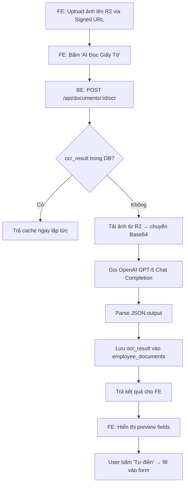
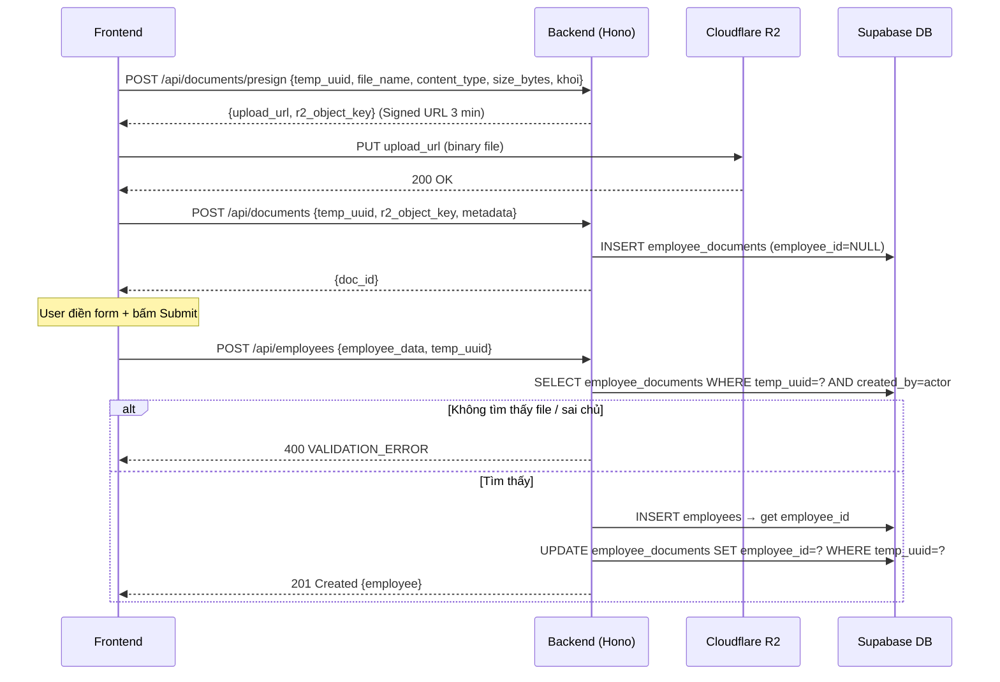

# Feature Plan: Phase E — Upload giấy tờ + AI OCR

> **Trạng thái**: 🔄 Đang thực hiện (BE partially done, FE chưa bắt đầu)
> **Feature slug**: phase-2-taskE
> **Tách từ**: `.agent/active/phase-2-ns-001-employee-crud/` (Phase 2 NS-001)
> **Ngày tách**: 2026-04-01
> **Lý do tách**: File gốc quá dài (550+ dòng) gây lỗi cấu trúc khi AI edit; Phase E có scope độc lập đủ để quản lý riêng.

---

## 1. Bối cảnh

Phase A–D của NS-001 Employee CRUD đã hoàn thành (CRUD, search, filter, export, state machine, change history). Phase E bổ sung khả năng upload giấy tờ tuyển dụng và AI OCR auto-fill vào **form tạo NS mới (Create mode only)**.

**Tham chiếu plan gốc:** `.agent/active/phase-2-ns-001-employee-crud/FEATURE_PLAN.md` (mục 5 AC-19, mục 7 Risk, mục 8a)

## 2. Mục tiêu

EA upload ảnh giấy tờ → AI OCR tự đọc và điền thông tin vào form tạo mới NS. Chỉ áp dụng mode Create-only (FR-03). Edit mode KHÔNG có upload component.

## 3. Kiến trúc AI OCR

### Provider Strategy
- Sử dụng **OpenAI GPT-5 (hoặc GPT-4o)** thông qua Proxy (`proxycli.playai.vn/v1`).
- Mô hình mặc định: `gpt-5` (tối ưu hóa cho bóc tách JSON và tiếng Việt).
- Cơ chế gửi ảnh: Ưu tiên truyền ảnh dưới dạng **Base64** (Data URI) trực tiếp trong request body thay vì truyền URL. Lý do: Proxy Server bị chặn Egress — đã xác nhận qua test 2026-04-01.

### Luồng xử lý



### Luồng Upload + Bind



## 4. Cấu hình môi trường

| Biến | Mô tả | Bắt buộc |
|------|--------|----------|
| `OCR_PROVIDER` | `openai` / `claude` / `vision` | Có (default: `vision`) |
| `OCR_API_KEY` | API key của provider | Có |
| `OCR_API_URL` | Base URL cho proxy (nếu có) | Không |
| `R2_BUCKET_NAME` | Tên bucket Cloudflare R2 | Có |
| `R2_ACCESS_KEY_ID` | R2 access key | Có |
| `R2_SECRET_ACCESS_KEY` | R2 secret key | Có |
| `R2_ENDPOINT` | R2 endpoint URL | Có |

## 5. Gap Analysis — Trạng thái thực tế vs Doc

> [!WARNING]
> Các task BE được đánh dấu `[x]` trong log cũ nhưng **flow create/upload chưa khép kín**. Chi tiết:

| Vấn đề | File | Dòng | Mô tả |
|--------|------|------|-------|
| `createEmployeeSchema` thiếu `temp_uuid` | `employee.ts` | L89-99 | Schema có `.strict()` → sẽ reject `temp_uuid` nếu FE gửi lên |
| `employeeService.createEmployee` yêu cầu `temp_uuid` | `employeeService.ts` | L188, L192 | Service expect `temp_uuid` từ parsed body |
| Route parse body bằng shared schema | `employees.ts` | L116, L129 | Route dùng `createEmployeeSchema.safeParse(body)` → `temp_uuid` bị strip/reject |

**Quy định phân quyền (Authz):**
- [1. Presign] Yêu cầu EA/SA.
- [2. Draft-Unbound] Chỉ SA hoặc chính User đã upload.
- [3. Bound-to-employee] Cho phép SA, EA chung khối, và **Reviewer được gán** cho NS đó. Mọi route trả 403 cho user VI/VA (trừ khi họ là Reviewer của chính NS đó).

**Kết luận:** Task E.2 (Bind logic) và E.5 (Shared schema thêm `temp_uuid`) phải được làm cùng nhau mới khép kín. Hiện tại chỉ có file code cho documents routes và OCR service — nhưng flow end-to-end chưa chạy được.

## 6. Test artifacts đã có

| File | Mô tả | Trạng thái |
|------|--------|------------|
| `backend/scripts/test_ocr_openai.ts` | Script test AI OCR độc lập | ✅ Pass (kết nối GPT-5 thành công) |
| `backend/.env.test` | Env test với OCR key | ✅ Sẵn sàng |
| `backend/test_request.json` | Payload mẫu cho curl test | ✅ Sẵn sàng |

**Lệnh chạy test:**
```bash
cd backend
npx tsx scripts/test_ocr_openai.ts
```

## 7. Rollback Plan

- DB Migration: `ALTER TABLE employee_documents DROP COLUMN ocr_result`
- Infra: Revert biến `R2_*` và `OCR_*` khỏi env
- FE: Tắt/revert component DocumentUpload trong EmployeeCreatePage
- BE: Revert documents routes mount trong `index.ts`

## 8. Tham chiếu

- Plan gốc Phase 2: `.agent/active/phase-2-ns-001-employee-crud/FEATURE_PLAN.md`
- Business doc: `.agent/business/modules/NS-001_employee_crud.md`
- Schema SQL: `database/001_schema.sql` (v2.5.1)
- Zod schemas: `packages/shared/src/schemas/employee.ts`
- OCR Service: `backend/src/services/ocrService.ts`
- Documents routes: `backend/src/routes/documents.ts`
